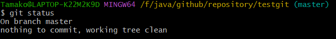
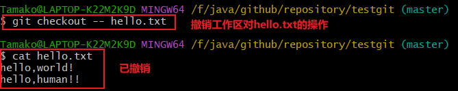
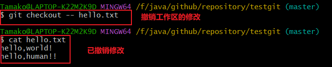
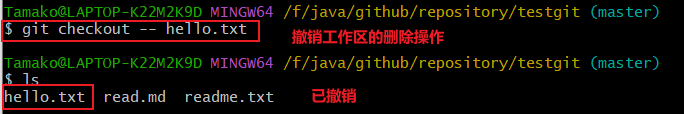
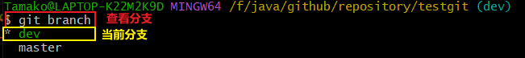
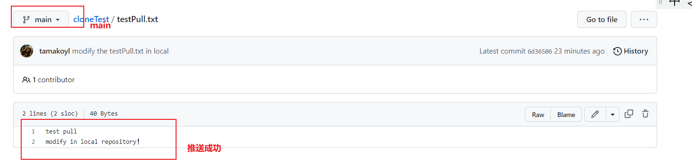

#  Git 入门

本文主要参考博文

http://t.csdn.cn/Sxf5l


## （一）Git介绍与安装

### 1 Git介绍


### 2 Git的安装

安装最后一步

因为Git是分布式版本控制系统，所以需要填写用户名和邮箱作为一个标识

```shell
#配置用户名
$ git config --global user.name "tamako"

#配置用户邮箱
$ git config --global user.email "884920265@qq.com"
```

**示意图**


**注意：**git config --global 参数，有了这个参数，表示你这台机器上所有的Git仓库都会使用这个配置，当然你也可以对某个仓库指定的不同的用户名和邮箱。

## （二）创建repository

### 1  创建一个文件夹作为repository

```shell
#进入该目录
$ cd /f/java/github
#新建一个文件夹
$ mkdir repository
```

### 2 初始化仓库

```shell
$ git init
```


### 3 新建一个readme.text

- 自己手动添加

- 使用vim read.text添加

  

  ​	

**否则**：

报错：fatal: pathspec 'readme.txt' did not match any files


### 4 将readme.txt添加到缓存区

```shell
$ git add readme.txt
```

**报错**：warning: in the working copy of 'readme.txt', LF will be replaced by CRLF the next time Git touches it


**原因**

出现warning: LF will be replaced by CRLF是换行符的原因

**解决**

办法很简单，一行代码，如下配置：

```shell
$ git config --global core.autocrlf false
```

最后尝试上传，无报错


### 5 提交缓存区的files

1. 输入提交命令

```shell
#提交
$ git commit
```

2. 输入变动信息


3. 提交成功


### 6 update

1. 查看仓库文件状态

```shell
$git status
```



此时没有要提交的file了


2. 修改readme.txt（相当于update了）

- 用vim修改
- 再次查看状态


3. 查看具体修改记录

```shell
$ git diff readme.txt
```


4. 提交修改后的readme.txt，完成update

```shell
$ git commit -am "update readme.txt"
```


5. 再次查看状态


​    修改提交成功


### 7 查看仓库日志

- 可以查看仓库内文件所有变动修改的具体信息
- q可以退出日志信息

```shell
$ git log
```


**总结**：要把注释写详细，变动信息写详细

## （三）版本变化

###  1 版本回退

**语法**

- 回退版本数少

```shell
$ git reset --hard HEAD^^^#回退三个版本
```

- 回退版本数多

```shell
$ git reset --hard HEAD~100#回退100个版本
```


**示例**

回退一个版本

- 未回退前：head指向 `f6ace1b`版本


- 回退后，head指向`035bb55`版本，回到了没有对readme.txt进行update前


### 2 版本前进

前面的版本存在下，版本前进，只能通过版本号进行前进

**语法**

```shell
#1.查询版本号
$ git reflog
#2.版本前进
$ git reset --hard f6aec1b[版本号]
```

**示例**


此时已经前进到最新版本了

### 3 版本变化总结

- 前进只能用版本号前进

**示意图**


## （四）工作区和缓存区

工作区：存放文件，有一个隐藏目录.git，但是这个不属于工作区，

版本库(repository)：

- stage(暂存区)
- 还有Git为我们自动创建了第一个分支master,以及指向master的一个指针HEAD。

我们前面说过使用Git提交文件到版本库有两步：

第一步：是使用 git add 把文件添加进去，实际上就是把文件添加到暂存区。

第二步：使用git commit提交更改，实际上就是把暂存区的所有内容提交到当前分支上。

**示意图**


添加一个新文件hello.txt，并提交


## （五）撤销修改

在提交前，发现修改有误，根据前面所学知识：

- 提交后，可以进行版本回退。
- 知道修改呢内容，再改回去（改动小还行，改动多直接g），最后在提交

上两种办法不灵活

**示意图**


**解决**

1. checkout（退房）用于撤销工作区的操作

```shell
$ git checkout --hello.txt
```

2. restore --stage 可用于撤销添加到缓存区操作

```shell
$ git restore --stage hello.txt
```

**示例**

1. 修改后，未添加到缓存区




2. 修改后，上传到了缓存区，但是未提交

此情况：

- 需要先撤销添加到缓存区
- 再撤销工作区的修改


撤销hello.txt添加到缓存区


撤销hello.txt工作区的修改



## （六）删除文件

- 从工作区删除文件

```shell
$ rm hello.txt
```

- 将删除文件信息，添加到缓存区

```shell
$ git rm hello.txt
```

**配合撤销操作**

- checkout（退房）用于撤销工作区的操作

```shell
$ git checkout --hello.txt
```

- restore --stage 可用于撤销添加到缓存区操作

```shell
$ git restore --stage hello.txt
```

**示例**

删除后的恢复：

可将删除看作对文件的修改

1. 删除后，未添加到缓存区

   

   

2. 删除后，提交到缓存区，但是未提交

- 先撤销提交到缓存区


- 再撤销工作区的操作



3. 删除后，提交到缓存区，并且提交到仓库

​		只能采用版本回退的办法了


## （七）远程登陆仓库

**说明**

在了解之前，先注册github账号，由于你的本地Git仓库和github仓库之间的传输是通过SSH加密的

### 1 创建SSH Key

在用户主目录下，看看有没有.ssh目录，如果有，再看看这个目录下有没有id_rsa和id_rsa.pub这两个文件，如果有的话，直接跳过此如下命令，如果没有的话，

输入命令：

```shell
$ ssh-keygen -t rsa –C "884920265@qq.com"
```

key generate，采用rsa非对称加密生成密钥

**截图**


创建成功


### 2 非对称密钥加密原理

### 3 SSH(Secure Shell)加密原理

作者参考了下面的博文：

http://t.csdn.cn/eBTTi

远程仓库采用的的是**密钥登录方式**


### 4 本地与github服务器建立SSH会话

1. 


2. 将客户端的公钥放在github服务器端


3. 


## （八） 远程添加库（关联仓库）

### 1 说明

当你从远程库克隆时候，实际上Git自动把本地的master分支和远程的master分支对应起来了，并且远程库的默认名称是origin

要查看远程库的信息 使用 git remote
要查看远程库的详细信息 使用 git remote –v

**演示**

1. 在github创建一个repository作为备份库   ------ 远程库origin
2. 将本地的repository与github的备份库同步 ------本地库

### 2 步骤

#### 2.1 创建备份库

在github新创建一个repository作为备份库


#### 2.2 仓库同步

将本地的repository与github的备份库同步（采用SSH来进行传输）

```shell
$ git remote add origin git@github.com:tamakoyl/remoteTest.git
$ git branch -M main
$ git push -u origin main
```

##### **step1**

​	远程连接GitHub仓库，输入命令

```shell
$ git remote add origin git@github.com:tamakoyl/remoteTest.git
```

​	

###### **报错**

​	要切换到本地的仓库，否则会报错：fatal: not a git repository (or any of the parent directories): .git

​	**报错截图**


###### 解决

​	将目录切换到本地仓库目录的master分支上


​	如果没有创建分支，使用命令

```shell
$ git init#初始化一个分支
```


##### step2

​	push入本地master分支，输入命令

```shell
$ git branch -M main
$ git push -u origin main
```

​	**截图**


​	同步成功


​	后续更新本地的master分支后

​	同步时直接输入命令：（前提已经将本地仓库与远程仓库关联了）

```shell
$ git push -u origin master
```


### 3 仓库关联之间验证错误

出现报错：“fatal: Could not read from remote repository.“

**解决**：删除原先密钥，重新生成密钥，再与GitHub关联

参考博文：

http://t.csdn.cn/xhuB8


## （九）将远程库克隆到本地库

### 1 克隆自己的仓库

说明：将cloneTest仓库克隆到本地仓库

输入命令：

```shell
$ git clone https://github.com/tamakoyl/cloneTest[远程库的url]
```

**示例**


### 2 克隆别人的仓库

- 将别人的仓库fork到自己仓库
- 再克隆

## （十）分支管理

**说明**

- 以上的学习中，我们都只有一条分支，就是master分支，它是根据时间线串起来的分支

- HEAD严格来说不是指向提交，而是指向master，master才是指向提交的，所以，HEAD指向的就是当前分支


### 1 创建、切换分支

注意：都是基于当前的master分支，创建的其他的分支

输入命令：

```shell
#创建dev分支
$ git branch dev
#切换到dev分支,checkeout也有勾选的意思
$ git checkout dev
#查看分支
$ git branch
```


**示例**


查看分支



### 2 合并分支

**说明**：演示合并分支冲突情况

- sub分支：对readme.txt进行修改（最后加？？？？？）
  1. 修改


​		2.提交到仓库


​		3.查看日志


- master分支：对readme.txt进行修改（最后加\*\****\***）


- 在master分支上合并sub分支，会产生冲突，因为在同一位置进行了修改


​	冲突：


- 解决：将readme.txt修改成自己想要的样子再提交


### 3 管理分支

#### 3.1 分支策略

1. master主分支应该是非常稳定的，也就是用来发布新版本，一般情况下不允许在上面修改
2. 一般在其他分支dev上进行修改，当需要发布或dev分支代码稳定后可以合并到主分支master上

#### 3.2 删除分支

说明：

1. 通常合并分支时，git一般使用”Fast forward”模式，如果删除了分支，就会删除分支的日志信息
2. 我们可以用no-ff来禁用”Fast forward”模式，保存分支dev日志信息

**演示**

1. 合并分支


2. 删除分支


### 4 bug分支

**说明**

在开发中，会经常碰到bug问题，那么有了bug就需要修复，在Git中，分支是很强大的，每个bug都可以通过一个临时分支来修复，修复完成后，合并分支，然后将临时的分支删除掉

**问题情景**

- 你在sub分支工作，工作到一半，还不能提交，所以sub分支工作的内容还在stage（缓存区）
- 此时，出现了一个bug，需要你先来解决

**解决**

Git提供了一个stash功能，可以把当前工作现场 ”隐藏起来”，等以后恢复现场后继续工作。相当于另外开辟了一段内存空间来保存（使用栈的数据结构）

stash命令总结

| 命令            | 作用                                             |
| --------------- | ------------------------------------------------ |
| git stash       | 隐藏工作现场                                     |
| git stash list  | 查看隐藏记录                                     |
| git stash apply | 恢复工作现场，引用栈顶元素，需要手动删除栈顶元素 |
| git stash drop  | 删除栈顶元素                                     |
| git stash pop   | 恢复工作现场将栈顶元素弹出来，自动删除栈顶元素   |

1. 隐藏工作现场

```shell
$ git stash
$ git stash list#查看隐藏记录
```

2. 恢复工作现场

```shell
$ git stash apply # 引用，恢复工作内容，需要手动删除隐藏内容 

$ git stash pop #   将栈顶元素弹出来，自动删除隐藏内容    
```


**演示**

1. 隐藏三次工作现场

​		第一次：创建yuh.txt

​		第二次：创建anotheryuh.txt

​		第三次：创建thirdyuh.txt


2. 使用pop恢复现场（弹出栈顶元素）


3. 使用apply来恢复工作现场


#### stash命令总结

| 命令            | 作用                                             |
| --------------- | ------------------------------------------------ |
| git stash       | 隐藏工作现场                                     |
| git stash list  | 查看隐藏记录                                     |
| git stash apply | 恢复工作现场，引用栈顶元素，需要手动删除栈顶元素 |
| git stash drop  | 删除栈顶元素                                     |
| git stash pop   | 恢复工作现场将栈顶元素弹出来，自动删除栈顶元素   |

**示意图**


### 5 分支管理总结

| 命令                 | 作用                 |
| -------------------- | -------------------- |
| git branch           | 查看分支             |
| git branch name      | 创建分支             |
| git checkout name    | 切换分支             |
| git checkout –b name | 创建+切换分支        |
| git merge name       | 合并某分支到当前分支 |
| git branch –d name   | 删除分支             |

## （十）多人协作

参考博文：

http://t.csdn.cn/HJCL7

### 1 remote远程库说明

**示意图**


当你从远程库克隆时候：

- 实际上Git自动把本地的master分支和远程的master分支对应起来了
- 并且远程库的默认名称：origin
- 要查看远程库的信息 ： git remote
- 要查看远程库的详细信息 ：git remote –v


### 2 push[推送]分支

**说明**

- 将本地仓库该分支  push[推送]--->  远程库
- 推送时，要指定本地分支，这样，Git就会把该分支推送到远程库对应的远程分支上
- 使用命令 git push origin master[分支名]

**问题**：那么一般情况下，那些分支要推送呢？

master分支是主分支，因此要时刻与远程同步。
一些修复bug分支不需要推送到远程去，可以先合并到主分支上，然后把主分支master推送到远程去

### 3 抓取分支


#### 3.1 fetch分支

**目标**

将远程库dev分支同步到本地dev分支

**步骤**

- fetch是从远程库origin抓取dev分支的更新信息 

  **注意**---- 本地dev分支并不会改变，但是本地已经保存了远程fetch的dev分支

```shell
$ git fetch origin
```

- 将抓取的dev分支合并到本地dev分支

```shell
$ git merge
```

**演示**

1. 远程库在main分支新建一个testFetch.txt文件
2. 在本地库fetch并且合并

**截图**


#### 3.2 pull分支

使用命令

```shell
$ git pull#自动与本地对应分支合并
```

相当于fetch + merge，不用手动merge


#### 3.3 pull与fetch的区别

fetch： 本地dev分支并不会改变，但是本地已经保存了远程fetch的dev分支，还需要合并

pull：直接将远程仓库的dev分支拉回到本地dev分支同时合并

**示意图**


#### 4 分支冲突及解决

**冲突场景**

- push分支失败：

​		**原因**：远程分支比本地分支更新早

​		**解决**：1.用git pull试图合并，如果合并有冲突

​					2.则需要解决冲突，并在本地提交

​                    3.git push origin branch-name推送。

**演示**

1.


2.


3.


4. 




