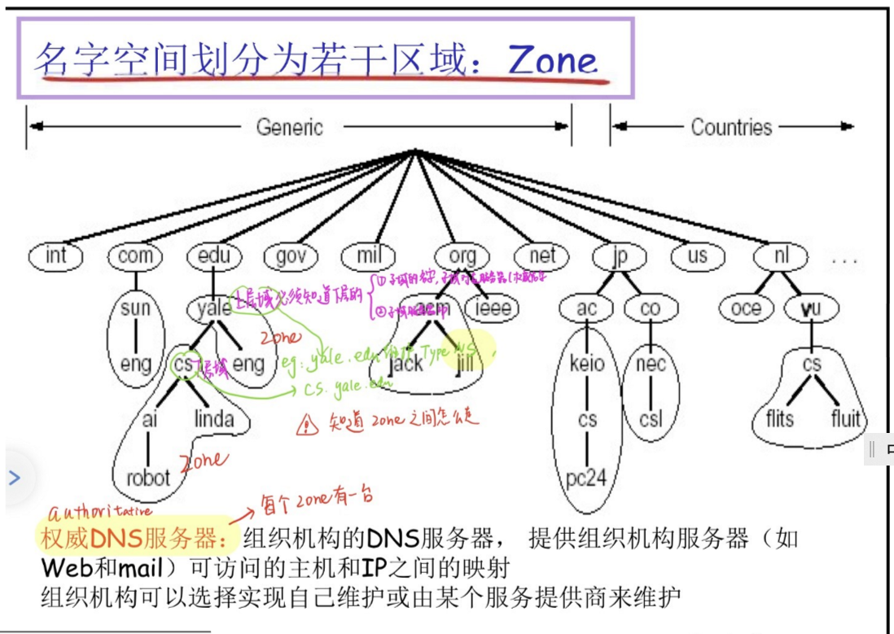
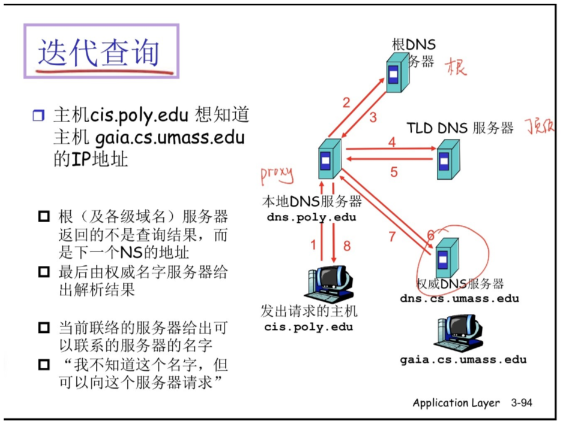

# GitHub

## （一） GitHub入门实战

上传网站

### 1 步骤

#### 1.1 注册github账号

推荐使用Chrome浏览器  + vpn

没有梯子推荐使用dev-sidecar工具

#### 1.2 创建一个仓库

格式：username.github.io

选择public

#### 1.3 下载github desktop，并和github关联

官网：https://desktop.github.com/

注意：用梯子下载不然太慢了

github授权

#### 1.4 克隆username.github.io仓库

注意：可以选择保存位置

#### 1.5 将本地的文件上传到github的仓库

1. 

2.

3. 

#### 1.6 成功访问上传网站

**缺点：**此域名为二级域名

#### 1.7 升级为顶级域名

1. 申请一个顶级域名freenum
2. 将该域名指向username.github.io
3. 

## （二）仓库介绍

### 2.1 github工具栏介绍

#### 1 右侧tag

#### 2 code栏

#### 3 issues栏

#### 4 pull requests 栏

#### 2.1.5 Actions 栏

- 推出的CI/CD服务（持续集成、持续交付、持续部署）

- 作用

  1. 在master分支上提交了一段代码，可以自动部署到指定的服务器

  2. 还可以将代码做成镜像，并自动提交到镜像仓库

#### 6 Projects 栏

前提：需要有仓库的管理权限

- 项目版
- 用于组织工作与排列工作的优先级
- 项目板：议题、pr、注释（生成卡片）
- 拖动可改变顺序

#### 7 wiki

- 维基百科
- 对项目进行说明，支持markdown

#### 8 insights

项目总体浏览相关统计信息

- contributors：用户在相应日期改动代码的大概数量
- commits：显示一年收到提交数（判断活跃程度）
- code frequency：显示代码改变数量
- networks：包括克隆仓库在内所有分支的提交
- fork：服务端代码仓库克隆的情况

#### 9 setting

### 2.2 项目不同版本比较

1. 

2. 

## （三）github使用问题

### 1 关于github无法显示上传图片

参考博文：http://t.csdn.cn/kmaIC

#### 1.1 关于DNS的介绍

DNS(domain name system)：域名解析系统

- 作用：url    ------>   IP的转换（跑在UDP上面，由应用层实现网络核心的功能）。

- 它提供的服务：

（1）分层命名  ----- >   分层的、基于域的命名机制

（3）增删域名（维护问题）

（2）分布式解析域名

由于一个name server存在可靠性、可扩展性、不易维护的问题，所以采用分布式解析域名。

讲名字空间划分为若干个域，每个域都有一个权威服务器。

#### 1.2 DNS的解析过程

使用迭代式查询，主机向local name server 发送一个请求，local name sever再向根DNS服务器请求，根DNS服务器不会直接查询并返回相应IP，而是会返回下一个name sever的地址，依次迭代最终得到主机的IP。这样可以大大减轻根DNS服务器的负担。

#### 1.3 解决

将GitHub的域名与ip的映射直接放在host配置文件里面，使用时直接查本地就可以解析域名，不用在请求域名解析。

#### 1.4 关于windows下修改host文件

参考博文：http://t.csdn.cn/dMYoV

