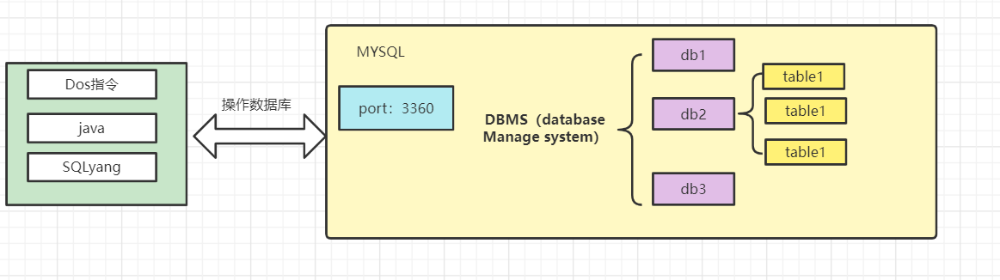
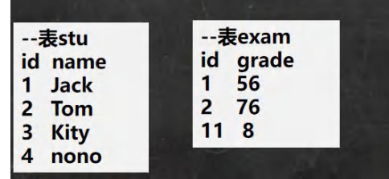

# MySQL

## （一） 数据库介绍

### 1.1 数据库三层结构

**示意图**



### 1.2 数据在数据库中的存储方式

表的一条记录 ---->java中的一个对象


### 1.3 SQL语句分类

- DD(define)L：数据定义
- DM(manage)L：数据管理

- DQ(query)L：数据查询
- DC(control)L：数据控制

## （二） 数据库操作

### 2.1 创建数据库

- 语法

```sql
CREATE {DATABASE | SCHEMA} [IF NOT EXISTS] db_name#数据库名字
    [create_specification [, create_specification] ...]


create_specification:
    [DEFAULT] CHARACTER SET charset_name#字符集
  | [DEFAULT] COLLATE collation_name#校验规则
```


- 示例

```sql
#创建一个名叫jdbc的数据库，字符集为utf8，校验规则
create database jdbc character set utf8 collate utf8_bin;
```


### 2.2 查看、删除数据库

- 语法

```sql
#查看
show database jdbc
#删除
drop database jdbc
```

### 2.3 数据库的备份


## （三）表的操作

### 3.1 创建表

- 语法

```sql
create table `user`{
id int,#id为int类型
name varchar(20),#name为varchar类型
}character set utf8 collate utf8_bin engine innodb #字符集  校验规则  引擎类型
```

### 3.2 MySQL常用数据类型（列类型）


- 日期类型的基本使用

### 3.3 修改表


**示例**

```sql
--员工表emp的上增加一个image列，varchar类型(要求在resume后面)
alter table emp 
	add image varchar not null default ''
	after `resume`
	
--修改job列，使其长度为60。	
alter table emp
	modify job varchar(60) null default ''

--删除sex列。
alter table emp
	drop sex
	
	
--表名改为employee。	
rename table emp to employee


--修改表的字符集为utf8
alter table employee character set utf8
```


## （四）数据库的DRUD

### 4.1 insert

- 插入记录

**语法**

```sql
insert into tablename [values](data....data)
```


**示例**

```sql
insert into `user`(1,'jim')#向user表中添加一条记录

insert into `user`(2,'marry'),(3,'joe')#一次性添加多条记录
```

**注意**

1. 字符和日期类型需要包含在单引号里面
2. 一次可添加多条记录
3. 添加值的顺序应该一一对应


### 4.2 update

- 更新记录

**语法**

```sql
update tablename set  [修改多列]column1_name=...,column1_name=... [condition]where
```


**示例**

```sql
#将jim的薪水在原有基础上增加1000元
update emp 
	set salary=salary +1000
	where user_name='jim'

```


### 4.3 delete

- 删除记录

**语法**

```sql
delete from tablename [condition]where...
```


**示例**

```sql
#删除名为jim的记录
delete from emp where user_name='jim'
```

### 4.4 select

+ 查询记录

#### 1 单表查询

**语法**

1. 查询列

```sql
select [distinct去重]  *[所有行]|column1,column2... from tablename where[condition]
```

2. 给列取别名

```sql
select column_name as new_name  from tablename
```

**示例**

```sql
-- 查询表中所有学生的信息。
select * from student

-- 查询表中所有学生的姓名和对应的英语成绩。
select name,english_scorces from student

-- 过滤表中重复数据distinct
select distinct name,english_scorces from student

-- 给english_scorces取别名
select english_scorces as english from student
```


3. where进行过滤查询


**示例**

```sql
#找到姓赵同学的成绩
select * from student where name='赵%'

-- 查询英语成绩大于90分的同学
select * from student where English > 90

-- 查询数学分数为89,90,91的同学。
select * from student where math in(89,90,91)
```

#### 2 order by

- 对查询结果进行排序排序

**语法**

```sql
select [distinct去重]  *[所有行]|column1,column2... from tablename where[condition] order by column...#默认升序
```


**示例**

```sql
#-- 对数学成绩排序后输出[升序]
select * from student order by math 
-- 对总分按从高到低的顺序输出 [降序] -- 使用别名排序
select (math+chinese+english) as total from student order by total desc
```

#### 3 group by...having...

**语法**

```sql
select column1,column2... from tablename where....group by column having[在查询的结果中再过滤] ......
```


**示例**

```sql
-- ?如何显示每个部门的平均工资和最高工资
select avg(sal),min(sal) from emp group by deptno[部门编号]

-- ?显示每个部门的每种岗位的平均工资和最低工资
select avg(sal),min(sal) from emp group ny job

-- ?显示平均工资低于 2000 的部门号和它的平均工资 // 别名
select avg(sal) as avg_sal ,min(sal) from emp 
	   group by deptno[部门编号]
	   		where avg_sal < 2000
```

#### 4 函数

##### 4.1  统计函数

1. count：返回总行数

**语法**

```sql
select count(*) from tablename where....
```


**示例**

```sql
-- 统计数学成绩大于 90 的学生有多少个？
select count(*) from student where math>90
```


**注意**

count(*) 和 count(列) 的区别 

- count(*) 返回满足条件的记录的行数 
- count(列): 统计满足条件的某列有多少个，但是会排除 为 null 的情况


2. sum：返回满足where条件的行的和

​       avg

​       max

​       min

**语法**

```sql
select sum(column) from tablename where....#求和
select avg(column) from tablename where....#求平均值
select max(column) from tablename where....#求最大值
select min(column) from tablename where....#求最小值
```


**示例**

```sql
select sum(math) from student 
select avg(math) from student 
select max(math) from student 
select min(math) from student 
```


##### 4.2  数学相关函数


##### 4.3  字符串相关函数


**示例**

```sql
-- 以首字母小写的方式显示所有员工 emp 表的姓名
-- 思路：将第一个字母小写，再将其与大写拼接起来
select concat(lcase(substring(ename,1,1)),ucase(substring(ename,2))) from emp
```


##### 4.4  日期相关函数


**示例**

```sql
select * from news
		where DATE_SUB(NOW(),send_time,interval MINUTE) <= 10
-- unix_timestamp() : 返回的是 1970-1-1 到现在的秒数 
-- 一个 unix_timestamp 秒数[时间戳]，转成指定格式的日期 -- %Y-%m-%d 格式是规定好的，表示年月日 
-- 意义：在开发中，可以存放一个整数，然后表示时间，通过 FROM_UNIXTIME 转换 

1.得到一个int值
select from_unixtime() from dual[亚元表,做测试]

2. 将int还成日期
SELECT FROM_UNIXTIME(1618483484, '%Y-%m-%d') FROM DUAL;
```


##### 4.5  加密相关函数


##### 4.6  流程控制函数


#### 5 加强查询

##### 5.1 介绍

实际开发中使用where，like(模糊查询)，order by等一起使用，达到加强的查询的目的

- where
- like

`%`:表示0-多个字符

_:表示单个字符

**示例**

```sql
-- ■ 如何使用 like 操作符(模糊) 
-- %: 表示 0 到多个任意字符 _: 表示单个任意字符 
-- ?如何显示首字符为 S 的员工姓名和工资
select ename,sal from emp where name like 'S%'

-- ?如何显示第三个字符为大写 O 的所有员工的姓名和工资
select ename,sal from emp where name like '__O%'

-- ?按照部门号升序而雇员的工资降序排列 , 显示雇员信息
select * from emp order by deptno ASC,sal DESC
```


##### 5.2 分页查询

**语法**

```sql
select * from tablename
	order by column
	limit 每页显示记录数 * (第几页-1)[id所在的行号],每页显示记录数
```

**示例**

```sql
-- 分页查询 
-- 按雇员的 id 号升序取出， 每页显示 3 条记录，请分别显示 第 1 页，第 2 页，第 3 页
-- page 1
select * from emp 
	order by id
	limit 0,3
-- page 2	
select * from emp 
	order by id
	limit 3,3	
-- page 3	
select * from emp 
	order by id
	limit 6,3	
```

##### 5.3 使用分组查询group by

按照某一列进行分组

**语法**

```sql
select column1,... from tablename group by column....
```

**示例**

```sql
-- 查询各个部门的平均工资
select avg(sal),deptno from emp group by deptno
```

**示意图**

-

##### 5.4  加强查询的一般顺序


#### 6 多表查询

- 实际开发中，往往是多张表的查询。
- 多表查询的过程(有表A、B)

1. 得到A、B的笛卡尔积(交集所有情况)
2. 对笛卡尔积进行过滤(where)

**注意**

- 列名字发生冲突，必须指明该列属于那张表如`table1.column`与`table2.column`
- 常常用数值相同的列进行过滤

**示例**

```sql
-- 多表查询 

-- 老韩小技巧：多表查询的条件不能少于 表的个数-1, 否则会出现笛卡尔集 
-- ?如何显示部门号为 10 的部门名、员工名和工资
select ename,dname,sal,dept.deptno from emp,dept 
	where emp.deptno = dept.deptno and emp.deptno=10
	
-- ?显示各个员工的姓名，工资，及其工资的级别
select ename,sal,grade from emp,salgrade
	where sal between losal and hisal
```


#### 7 自连接

指在同一张表的连接查询(同一张表当做两张使用)，就是给表区别名来使用

**语法**

```sql
select * from tablename nickname1,tablename nickname2 where......
```


**示例**

```sql
-- 思考题: 显示公司员工名字和他的上级的名字 
-- 老韩分析： 员工名字 在 emp, 上级的名字的名字 emp 
-- 员工和上级是通过 emp 表的 mgr 列关联 

-- 这里老师小结： 
-- 自连接的特点
-- 1. 把同一张表当做两张表使用 
-- 2. 需要给表取别名 表名 表别名
-- 3. 列名不明确，可以指定列的别名 列名 as 列的别名

select worker.ename as '职员名',boss.ename as '老板名' from emp worker,emp boss
	where worker.mgr=boss.ename #mgr为上级员工编号
```

#### 8 子查询

说明：子查询就是嵌套查询，select里面套select

##### 8.1  子查询作为临时表

**语法**

```sql
(column1... from tablename)temp
```


**示例**

```sql
-- 请思考：查找每个部门工资高于本部门平均工资的人的资料 
-- 这里要用到数据查询的小技巧，把一个子查询当作一个临时表使用 
-- 1. 先得到每个部门的 部门号和 对应的平均工资 
select avg(sal) as sal_avg from emp group by deptno

-- 2. 把上面的结果当做子查询, 和 emp 进行多表查询
select * from emp,(select deptno,avg(sal) as sal_avg from emp group by deptno)temp
		where emp.sal > temp.avg_sal AND emp.deptno=temp.deptno
```

##### 8.2   多行子查询中all的使用

作用于所有查询的记录（全部）

**示例**

```sql
-- 请思考:显示工资比部门 30 的所有员工的工资高的员工的姓名、工资和部门号
select ename,sal,deptno from emp
	where sal > ALL(
    				select sal from emp where deptno=30)
    				
    				
 -- 等价于 
 SELECT ename, sal, deptno FROM emp
 	WHERE sal > ( SELECT MAX(sal) FROM emp WHERE deptno = 30 )
```

##### 8.3  多行子查询中any的使用

（存在）

**示例**

```sql
-- 请思考:如何显示工资比部门 30 的其中一个员工的工资高的员工的姓名、工资和部门号
select ename,sal,deptno from emp
	where sal > ANY(
    				select sal from emp where deptno=30)
    				
-- 等价于 
 SELECT ename, sal, deptno FROM emp
 	WHERE sal > ( SELECT MIN(sal) FROM emp WHERE deptno = 30 )
```


##### 8.4   多列子查询

**语法**

```sql
(字段 1， 字段 2 ...) = (select 字段 1，字段 2 from......) 
```


**示例**

```sql
-- 请思考如何查询与 smith 的部门和岗位完全相同的所有雇员(并且不含 smith 本人) 
-- (字段 1， 字段 2 ...) = (select 字段 1，字段 2 from 。。。。) 
-- 分析: 1. 得到 smith 的部门和岗位
select deptno,job from emp where ename='smith'

-- 2.把上面的查询当做子查询来使用，并且使用多列子查询的语法进行匹配
select * from emp where 
		(deptno,job)=(select deptno,job from emp where ename='smith') 
		and ename!='smith'
```


#### 9 合并查询

为了合并多个select语句的结果

- union 去重
- union all 不去重

**语法** 

```sql
-- 合并select1与select2的结果
-- []中内容为注释
select[1]....
	union[去重]|union all[不去重]
	select[2].....	
```

#### 10 表外连接

应用场景：两张表查询时，想要其中一张表的rows全部显示

- 左外连接：让左侧表完全显示
- 右外连接：让右侧表完全显示

**语法**

```sql
select column1...from table1 left|right join table2 on .....[condition] 
```

**示例**

- 有表格

-

```sql
-- 使用左连接 
-- （显示所有人的成绩，如果没有成绩，也要显示该人的姓名和 id 号,成绩显示为空）
select name,stu.id from stu right join exam on stu.id=exam.id

-- 使用右外连接（显示所有成绩，如果没有名字匹配，显示空) 
-- 即：右边的表(exam) 和左表没有匹配的记录，也会把右表的记录显示出来
SELECT `name`, stu.id, grade FROM stu RIGHT JOIN exam ON stu.id = exam.id;
```

**结果图**

-


#### 11 表复制

说明：是表的自我复制、也叫蠕虫复制

应用：需要海量数据时(多次执行就可以得到)

**语法**

```sql
-- 自我复制
insert into table1 
	select * from table1
```

### （五）MySQL的约束

#### 5.1 简介

- 用于确保数据库的数据满足特定的商业规则

- 约束包括：

  1. not null
  2. unique：该列不能重复
  3. primary key：该列不能重复
  4. foreign key：
  5. check

  

#### 5.2 语法

```sql
column-name column-type primary key|unique|not null[除了外键]
```


#### 5.3 主键(primary key)

**语法**

```sql
column-name column-type primary key
```

**细节说明**

- 不能重复(字段数据只能有一个null)  +  不能为null
- 一张表只有一个主键，但是可以复合主键

**e.g.**

```sql
-- 创建一个user表
create table user(
id int,
name varchar(32),
email varchar(32),
primary key(id,name)#这里是复合主键
)
```

- 主键的指定方式：

  1. `    字段名字 字段类型 primary key`  

  2. 在建表的最后一行指定   `primary key(column1,...)`

- 使用     `desc  表名`    查看主键情况
- 在实际开发中会给一张表建一个主键

#### 5.4 unique

**语法**

```sql
column-name column-type unique
```

**细节说明**

- 如果没有指定not null，unique列可以有多个null
- 一张表可以有多个unique列

- unique not null 作用类似于主键，只不过可以有多个

#### 5.5 外键(foreign key)

**介绍**

1. 用于定义主表与从表之间的约束关系
2. 主表必须有主键或unique约束
3. 外键字段的值，只能是指向字段出现过的值   or  null[if 指向字段允许为null]

总结：相当于从表的某列，遵守主表的主键或unique约束

**语法**

```sql
foreign key(外键字段) references 主表名字(主键字段名|unique字段名) 
```


**细节说明**

1. 外键指向表的字段必须是    主键  or  unique
2. 表的类型必须是：innodb[支持外键]
3. 外键字段类型   ==  指向主表字段类型
4. 外键字段的值，只能是指向字段出现过的值   or  null[if 指向字段允许为null]
5. 一旦建立了外键约束，主表的data不能随意删除


**示意图**


**示例**

```sql
-- 建立主表class，将id设为主键
create table class(
id int primary key,
name varchar(32),
address varchar(32)
)

-- 建立从表student，class_id为外键，指向主表class的id
create table student(
id int,
name varchar(32),
class_id int,
foreign key(class_id) references class(id)    
)
```

#### 5.6 check(了解)

说明：只做语法校验，不会生效

**示例**

```sql
CREATE TABLE t23 (
    id INT PRIMARY KEY, 
    `name` VARCHAR(32) , 
    sex VARCHAR(6) CHECK (sex IN('man','woman')),#校验性别
    sal DOUBLE CHECK ( sal > 1000 AND sal < 2000) #校验工资
);
```

#### 5.7 MySQL约束总结

| 约束名称         | 说明                                                         | 常用 |
| ---------------- | ------------------------------------------------------------ | ---- |
| 主键 primary key | 只有一个主键字段[不能是null字段]，且不能重复[只能有一个null] | √    |
| 外键 foreign key | 相当于从表的某列，遵守主表的主键或unique约束                 | √    |
| unique           | 可以用多个unique字段，且unique字段值可以有多个null           | √    |
| not null         |                                                              | √    |
| check            | 做语法校验，不会生效                                         | ×    |

